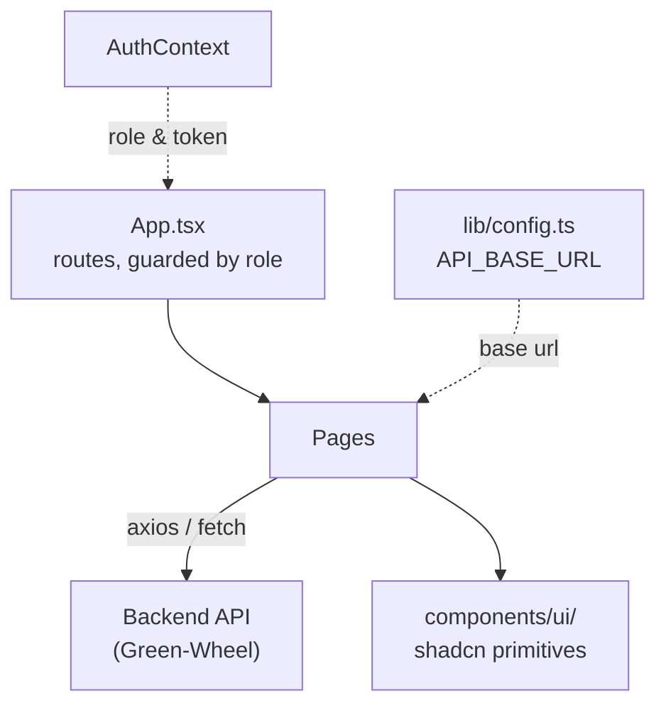

# greenwheels-cycle-hub — Staff & Admin Console

The web app for everyone who isn't a rider: station staff verifying and closing out trips, station admins managing their fleet, superadmins running the whole system, maintenance crews clearing issue reports. React 18 + Vite + TypeScript, UI built on shadcn/ui (Radix primitives + Tailwind).

Originally built via the [Lovable](https://lovable.dev) AI app builder, then reconnected to a real backend and debugged by hand — see [`CHANGELOG.md`](CHANGELOG.md) for that story.

## Architecture



- **Routing**: `react-router-dom`, all defined in [`App.tsx`](../src/App.tsx). Every non-public route is wrapped in `<ProtectedRoute roles={[...]}>`, which checks the logged-in user's role against an allow-list before rendering.
- **Auth**: `contexts/AuthContext.tsx` holds the current user/token; `components/ProtectedRoute.tsx` is the gate.
- **Data fetching**: mostly direct calls from page components (some via `@tanstack/react-query`), all going through one base URL.
- **API base URL**: [`lib/config.ts`](../src/lib/config.ts) reads `VITE_API_BASE_URL` from `.env`, falling back to `http://127.0.0.1:8000` so `npm run dev` works with zero setup. **This is the one thing to check before assuming "the console can't reach the backend" is a code bug** — it's very possibly just an unset env var.
- **UI kit**: `components/ui/` is shadcn/ui — copy-in components, not an npm dependency, so they're freely editable in place.

## Who sees what

Routes are gated by role at the router level (`ProtectedRoute roles={[...]}`), not just hidden in the UI:

| Role | Landing area | Can access |
|---|---|---|
| `superadmin` | `/admin-dashboard` | Everything — stations, users, bikes, reports, revenue, staff-panel, reservations |
| `admin` (station admin) | `/station-admin-dashboard` | Their station's staff/bikes, station reports, user management, reservations, maintenance issues |
| `staff` | `/staff-panel` | Trip verification, ending trips, cash-payment confirmation, active rides, reservations, maintenance issues |
| `maintenance` | `/maintenance-dashboard` | Maintenance queue, staff/user issue reports |

## The core workflow: the Staff Panel

`pages/StaffPanel.tsx` is the single busiest screen in the app — it's the console's half of the [ride flow](../../README.md#how-a-ride-actually-works-end-to-end):

1. Staff types in a rider's tracking code → `POST /staff/verify-trip` (or `/verify-reservation-trip`) → trip goes `active`, and the panel renders bike + rider details.
2. Staff ends the trip → `POST /staff/end-trip` → trip goes `payment_pending`.
3. The panel polls every 5s. If the trip is a cash payment, a `GET /staff/trip/{tripId}/cash-payment-summary` lookup runs; a 404 (not a cash payment yet — e.g. still-pending Chapa) just falls through to the next poll unchanged. A found cash payment stops the polling loop and shows a **Confirm Cash Payment** panel (rider name + ETB amount).
4. Confirming calls `POST /staff/confirmCashPaymentByTripId/{tripId}`, then opens `TripReceiptStaff` — the same receipt dialog either payment path ends on.

Related pages: `ActiveRides.tsx` (live map of in-progress trips), `staff/Reservations.tsx`, `staff/MaintenanceIssues.tsx`.

## Running it locally

```bash
npm install
cp .env.example .env   # already done in this checkout — VITE_API_BASE_URL=http://127.0.0.1:8000
npm run dev             # http://localhost:8080
```

Needs a running backend to actually do anything — see [`Green-Wheel`'s docs](../../Green-Wheel/docs/README.md) for how to start it. `tsc --noEmit` and `npm run build` are the fast sanity checks before calling anything done here.

## Known gaps (as of this writing)

- `StaffPanel.tsx` still fetches `/api/reservations`, a route that doesn't exist (404s) — harmless, because the state it sets is never rendered, but worth cleaning up if you're back in this file.
- A recurring unrelated console warning, `"No station ID found in localStorage"`, comes from some bundled hook — not chased down; likely `Login.tsx` not persisting something a downstream hook expects.
